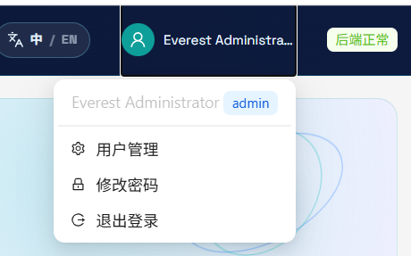
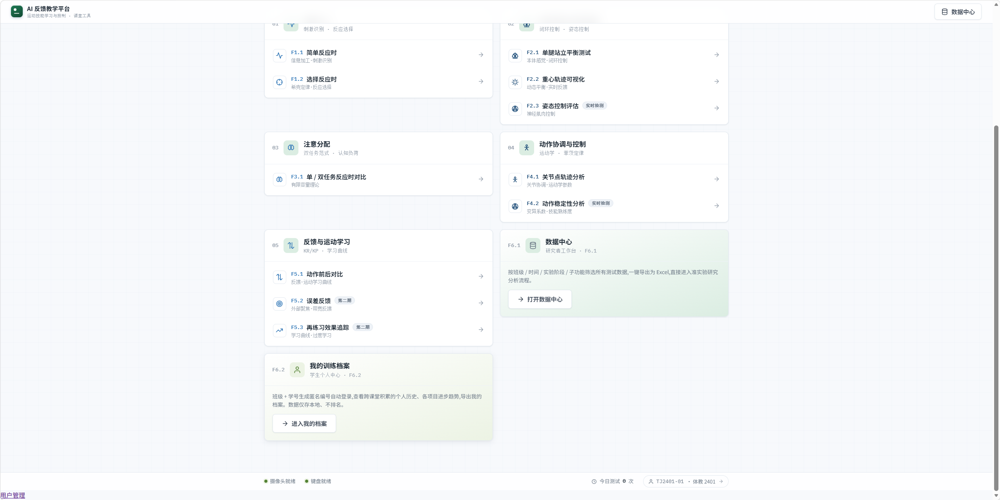
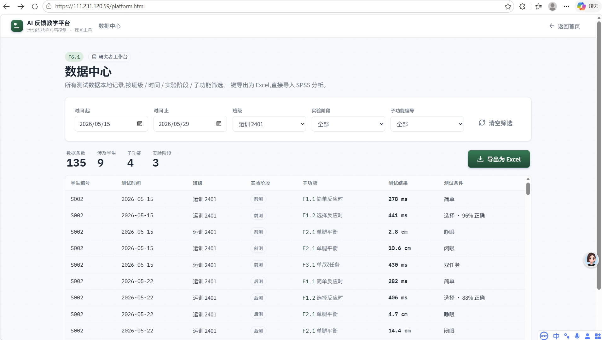

# AI反馈教学平台操作手册

## 一、相关文档

| 文档名称 | 指向资料 | 说明 |
| --- | --- | --- |
| 总体设计 | 《总体设计》 | 说明软件整体功能、页面组成、运行环境和业务边界。 |
| 详细设计 | 《详细设计》 | 说明各功能页面、输入输出、状态变化和处理规则。 |
| 测试案例 | 《测试案例》 | 记录主要功能的操作场景、预期结果和异常提示。 |

## 二、说明

AI反馈教学平台 V1.0适用于教育软件（运动技能学习与体育教学测评）场景。用户进入系统后，可以围绕实际工作内容完成账号进入、业务创建、过程查看、结果确认和资料管理等操作。

日常使用时，运动技能学习与控制课程教师、运动科学和体育教学研究者、学生用户、系统管理员可以按照页面提示从入口进入相应页面，查看当前业务状态，并根据页面中的按钮、输入框、列表或弹窗继续处理。把反应时、双任务、平衡、姿态对称性和动作稳定性等课堂表现转成可查看、可追踪的指标，并通过权限化数据中心和个人训练档案支持反馈与再练习。

面向《运动技能学习与控制》课程的浏览器课堂测评与训练追踪软件，连接教师和研究者的课堂任务、学生的测评操作与后续训练记录。

平台用于课堂测评和训练记录整理，测评结果用于教学反馈与过程观察，不替代医疗诊断或专业康复结论。

姿态测评需要用户主动授权摄像头，系统只保存姿态指标、报告和训练记录，不上传原始视频。

课堂使用时先完成账号登录和权限检查，再从课程首页选择本次任务；有摄像头的功能在开始检测前确认画面和站位。

测评完成后先查看页面反馈，再进入个人档案或数据中心进行复核和授权范围内的导出。

本手册用于说明软件的用途、功能特点、运行要求和页面操作流程。各功能章节按用户能够看到的页面、入口、按钮、输入项、提示信息和处理结果进行说明。

## 三、功能特点

用户可在账号登录与首次修改密码页面验证用户身份并建立受保护的课堂使用会话；首次登录的账号需要先完成密码修改。页面上的用户名输入框、密码输入框、登录按钮、当前密码输入框和新密码输入框会集中呈现当前可操作内容，用户处理完成后可以看到登录失败时显示错误提示、登录成功后显示当前用户和角色和改密成功后建立新的有效会话。

在课程首页与权限模块导航页面中，用户主要处理集中展示课程模块和功能编号，并根据当前用户权限隐藏不可访问的入口。系统把平台标题和课程说明、模块卡片、功能编号、功能入口箭头和数据中心入口放在当前操作区域，处理结束后会反馈首页根据权限更新模块入口、点击功能后进入对应测评页面和无权限操作显示访问受限提示。

课堂反应与注意力测评页面关注的是支持简单反应、选择反应以及单任务和双任务条件下的课堂表现记录。用户通过功能标题和说明、任务条件选择、开始或重新开始按钮、刺激和反应区域和反应结果确认当前状态，并在操作结束后获得页面显示本次反应结果、完成后显示统计或对比信息和重新测试后更新当前结果。

用户可在平衡、姿态与动作稳定性测评页面通过浏览器摄像头识别人体姿态关键点，生成平衡、姿态对称性、关节轨迹和动作稳定性指标。页面上的功能说明和测试条件、摄像头预览、开始检测按钮、停止并生成报告按钮和姿态关键点画面会集中呈现当前可操作内容，用户处理完成后可以看到显示实时姿态关键点和检测状态、生成姿态质量与指标报告和自动保存本次姿态指标和训练记录。

在反馈与运动学习记录页面中，用户主要处理把动作前后表现、误差反馈和再练习效果串联为可回顾的训练过程。系统把前后阶段或条件选择、测评结果卡片、误差或建议信息、历史记录列表和训练次数和变化提示放在当前操作区域，处理结束后会反馈页面显示前后对比或误差方向、新增训练完成后更新记录数量和训练档案按时间展示历史变化。

数据中心筛选与导出页面关注的是为教师和研究者提供训练记录查询、统计和授权范围内的表格导出。用户通过时间起止筛选、班级下拉框、实验阶段下拉框、子功能编号下拉框和清空筛选按钮确认当前状态，并在操作结束后获得筛选后统计卡片和表格同步更新、无匹配记录时显示空状态和导出成功后浏览器下载授权范围内的 Excel 文件。

我的训练档案页面集中展示学生个人训练记录、姿态报告和累计训练情况，支持个人复盘。页面上的学生身份摘要、训练次数和功能统计、历史记录列表、姿态报告摘要和刷新按钮会集中呈现当前可操作内容，用户处理完成后可以看到显示个人训练汇总、新记录保存后历史列表可刷新看到和无记录时显示空状态和测评入口。

在管理员用户与权限管理页面中，用户主要处理维护系统账号、角色、状态、逐用户模块权限和下载权限，并保障有效管理员始终存在。系统把用户搜索框、用户列表、创建用户按钮、显示名、班级和学号字段和角色和状态选择放在当前操作区域，处理结束后会反馈创建或编辑成功后列表刷新、危险操作显示成功或失败提示和违反管理员保护规则时系统服务返回拒绝原因。

## 四、系统要求

| 系统要求 | 最低配置 | 推荐配置 |
| --- | --- | --- |
| 操作系统 | Windows 10/11、macOS 13 或 Linux 客户端 | Windows 11、macOS 14 或稳定版 Linux；服务器使用 Linux |
| 浏览器 | Chrome 或 Edge 近两个稳定版本 | 最新版 Chrome 或 Edge，并允许站点使用摄像头 |
| 摄像头与网络 | 姿态测评需可用摄像头、稳定网络和 HTTPS 安全上下文 | 全身可入镜的摄像头，距离约 2–3 米，使用稳定宽带 |
| 服务端支撑 | Python 3.11、相关软件能力、SQLite、Nginx；按实际并发配置 | 独立 Conda 环境、systemd 管理 相关软件能力、Nginx 反代本机 API |

请确保实际运行环境满足以上要求，以保证 AI 反馈教学平台能够正常打开页面、提交操作和展示处理结果。若部署方式、客户端形态或服务器环境与本表不同，应以实际确认的申请表环境字段为准。

## 五、账号登录与首次修改密码

用户可在账号登录与首次修改密码页面验证用户身份并建立受保护的课堂使用会话；首次登录的账号需要先完成密码修改。用户打开平台入口，系统未检测到有效会话时进入登录页；登录成功且需要改密时进入修改密码页。

管理员创建账号后，管理员和学生从登录页进入系统；学生或被要求改密的用户先完成新密码设置再访问课程页面。

用户在账号登录与首次修改密码页面会看到用户名输入框、密码输入框、登录按钮、当前密码输入框、新密码输入框、确认新密码输入框和错误提示和成功提示等信息，并可依据页面显示继续处理。

使用该功能时，用户先输入管理员提供的用户名和密码，随后点击登录并等待身份校验，接着若出现首次改密提示，输入当前密码和两次一致的新密码，最后提交后返回课程首页并查看右上角用户菜单。

页面会按照不提供用户自助注册入口、新密码至少 8 个字符且两次输入一致和停用账号、过期会话或错误密码不能登录等规则限制或提示用户。处理结束后，用户可以看到登录失败时显示错误提示、登录成功后显示当前用户和角色和改密成功后建立新的有效会话。

【截图预留：见截图：。】

## 六、课程首页与权限模块导航

课程首页与权限模块导航页面集中展示课程模块和功能编号，并根据当前用户权限隐藏不可访问的入口。用户登录成功后进入首页，或从其他页面点击返回首页；首页入口对应 platform.html。

用户登录后从课程首页了解模块用途，选择当前课程需要完成的功能；学生只能看到管理员授予的模块。

该部分提供平台标题和课程说明、模块卡片、功能编号、功能入口箭头、数据中心入口、我的训练档案入口和右上角用户菜单等页面内容，用户可据此查看状态、填写信息或选择下一步操作。

在该页面中，用户先阅读首页的课程说明和模块卡片，随后根据当前任务选择可见模块，接着点击具体功能编号进入测评页面，最后如需切换账号或进入管理功能，打开右上角用户菜单。

如果不满足无权限模块不在界面显示、直接访问无权限页面入口时显示无权限页面和系统服务数据通道再次校验登录状态和模块权限等要求，用户需要根据页面提示调整后再继续。页面反馈通常包括首页根据权限更新模块入口、点击功能后进入对应测评页面和无权限操作显示访问受限提示。

【截图预留：见截图：。】

## 七、课堂反应与注意力测评

用户可在课堂反应与注意力测评页面支持简单反应、选择反应以及单任务和双任务条件下的课堂表现记录。用户可以通过从课程首页进入信息加工模块的 F1.1、F1.2，或注意力分配模块的 F3.1 功能入口。

教师组织课堂练习或学生进行个人任务时，按页面提示完成刺激反应并比较不同任务条件下的表现。

页面上主要呈现功能标题和说明、任务条件选择、开始或重新开始按钮、刺激和反应区域、反应结果和准确率或对比结果等内容，这些内容用于帮助用户确认当前位置和可执行操作。

实际操作时，用户先阅读功能说明并确认任务条件，随后点击开始按钮等待刺激，接着按页面提示完成一次或连续多次反应，之后查看反应时、准确率或单/双任务对比结果，最后按照课堂要求重新测试或结束本次任务。

操作过程中需要注意必须先点击开始才能进入计时、结果只在完成有效任务后生成和异常中断时根据页面提示重新开始。操作完成后，系统会显示页面显示本次反应结果、完成后显示统计或对比信息和重新测试后更新当前结果。

【截图预留：当前自动归档截图集中展示课程首页、用户菜单和数据中心；本功能按实际测评页面保留截图位置。】

## 八、平衡、姿态与动作稳定性测评

用户可在平衡、姿态与动作稳定性测评页面通过浏览器摄像头识别人体姿态关键点，生成平衡、姿态对称性、关节轨迹和动作稳定性指标。用户可以通过从课程首页进入姿态相关功能，系统完成登录和模块权限校验后打开姿态分析页。

学生在完成 F2.1、F2.2、F2.3、F4.1 或 F4.2 测评时使用；教师可让学生按相同条件重复练习并比较结果。

用户在平衡、姿态与动作稳定性测评页面会看到功能说明和测试条件、摄像头预览、开始检测按钮、停止并生成报告按钮、姿态关键点画面、指标卡片、姿态质量、发现和建议和报告导出入口等信息，并可依据页面显示继续处理。

使用该功能时，用户先确认全身进入画面并将摄像头放在约 2–3 米处，随后点击开始检测并在浏览器提示时允许摄像头，接着按功能要求保持站立或完成重复动作约 5–10 秒，之后点击停止并生成报告，再查看姿态质量、对称性、关键发现和建议，最后在有下载权限时导出报告。

页面会按照摄像头只在用户主动点击开始检测后启动、关键点识别不稳定时按提示调整距离和站位、原始视频不上传，系统服务只接收姿态指标、报告和训练记录和未授予模块权限或下载权限时相应操作被拒绝等规则限制或提示用户。处理结束后，用户可以看到显示实时姿态关键点和检测状态、生成姿态质量与指标报告、自动保存本次姿态指标和训练记录和根据对称性和稳定性给出练习建议。

【截图预留：当前自动归档截图未覆盖姿态测评结果页，正式提交前可补充该页截图；此处保留截图位置。】

## 九、反馈与运动学习记录

用户可在反馈与运动学习记录页面把动作前后表现、误差反馈和再练习效果串联为可回顾的训练过程。用户可以通过从课程首页进入反馈与运动学习模块的 F5.1、F5.2 或 F5.3，或从训练档案回看已经保存的记录。

学生完成一次测评后，根据页面反馈调整动作并再次练习；教师使用记录观察课堂训练变化。

该部分提供前后阶段或条件选择、测评结果卡片、误差或建议信息、历史记录列表和训练次数和变化提示等页面内容，用户可据此查看状态、填写信息或选择下一步操作。

在该页面中，用户先选择需要比较的练习阶段或记录，随后查看当前结果和系统反馈，接着按照建议完成下一次练习，之后返回档案或记录列表确认新记录已经保存，最后根据时间顺序观察训练变化。

如果不满足只有完成并保存的测评才进入训练记录、学生只能查看本人记录和历史记录不可通过界面随意改写等要求，用户需要根据页面提示调整后再继续。页面反馈通常包括页面显示前后对比或误差方向、新增训练完成后更新记录数量和训练档案按时间展示历史变化。

【截图预留：当前自动归档截图未覆盖反馈结果页，正式提交前可补充该页截图；此处保留截图位置。】

## 十、数据中心筛选与导出

用户可在数据中心筛选与导出页面为教师和研究者提供训练记录查询、统计和授权范围内的表格导出。用户可以通过从课程首页的数据中心卡片或右上角数据中心入口进入；系统会先检查登录和数据中心模块权限。

管理员查看课程整体训练情况，或按班级、日期、实验阶段和子功能定位某一批记录。学生若被授予数据中心权限，只能查看自己的记录。

页面上主要呈现时间起止筛选、班级下拉框、实验阶段下拉框、子功能编号下拉框、清空筛选按钮、记录统计卡片、训练记录表格和导出为 Excel 按钮等内容，这些内容用于帮助用户确认当前位置和可执行操作。

实际操作时，用户先选择时间、班级、实验阶段或子功能条件，随后点击刷新或等待列表更新，接着查看记录数、涉及学生数和结果明细，之后确认当前账号具有下载权限后点击导出为 Excel，最后打开生成的文件检查筛选范围。

操作过程中需要注意无数据中心权限时页面页面入口和数据通道均拒绝访问、学生查询范围由系统服务限制为本人记录、无下载权限不显示或不能使用导出数据通道和导出数据通道再次校验登录、模块和下载权限。操作完成后，系统会显示筛选后统计卡片和表格同步更新、无匹配记录时显示空状态和导出成功后浏览器下载授权范围内的 Excel 文件。

【截图预留：见截图：。】

## 十一、我的训练档案

我的训练档案页面集中展示学生个人训练记录、姿态报告和累计训练情况，支持个人复盘。用户可以通过从课程首页的我的训练档案卡片或右上角入口进入；系统先检查训练档案模块权限。

学生完成课堂任务后查看历史记录、功能分布和训练变化，并在有下载权限时保存个人档案或报告。

用户在我的训练档案页面会看到学生身份摘要、训练次数和功能统计、历史记录列表、姿态报告摘要、刷新按钮、档案导出按钮和报告下载入口等信息，并可依据页面显示继续处理。

使用该功能时，用户先打开我的训练档案并查看身份摘要，随后浏览训练次数、功能分布和历史记录，接着点击某条记录查看结果或姿态报告，之后在有下载权限时导出档案或下载报告，最后点击刷新获取最新保存的训练记录。

页面会按照学生只能查询和导出本人记录、无训练档案权限时不能访问页面、导出和报告下载需要额外下载权限和空档案时显示引导用户开始一次测评的提示等规则限制或提示用户。处理结束后，用户可以看到显示个人训练汇总、新记录保存后历史列表可刷新看到和无记录时显示空状态和测评入口。

【截图预留：当前自动归档截图未覆盖训练档案页，正式提交前可补充该页截图；此处保留截图位置。】

## 十二、管理员用户与权限管理

用户可在管理员用户与权限管理页面维护系统账号、角色、状态、逐用户模块权限和下载权限，并保障有效管理员始终存在。用户可以通过管理员登录后打开右上角用户菜单，点击用户管理进入管理页；非管理员不能进入该页面。

管理员为课程创建学生账号，调整学生可见模块和下载范围，处理停用、密码重置、会话回收等账号事务。

该部分提供用户搜索框、用户列表、创建用户按钮、显示名、班级和学号字段、角色和状态选择、七个模块权限复选框、下载权限开关和编辑、停用、重置密码和回收会话按钮等页面内容，用户可据此查看状态、填写信息或选择下一步操作。

在该页面中，用户先点击创建用户并填写用户名、显示名、班级、学号、角色和初始密码，随后为学生逐项勾选模块权限并设置下载权限，接着保存后在用户列表检查状态，之后通过编辑入口修改允许修改的字段或调整权限，再需要时执行重置密码或回收会话，最后停用账号前确认不会影响系统最后一个有效管理员。

如果不满足不允许自助注册，用户名创建后不可修改、管理员不能停用自己或把自己降级为学生、任何操作都不能造成零个有效管理员和停用、角色变化、重置密码和回收会话会使旧会话失效等要求，用户需要根据页面提示调整后再继续。页面反馈通常包括创建或编辑成功后列表刷新、危险操作显示成功或失败提示、违反管理员保护规则时系统服务返回拒绝原因和权限变化后首页和数据通道按新权限生效。

【截图预留：见截图：。】

## 十三、典型使用流程

用户完成一次完整业务时，通常先进入 AI 反馈教学平台，再选择或创建业务对象，随后按照页面提示处理内容并查看结果。

用户使用管理员创建的账号登录系统，学生账号首次登录后按提示修改密码；系统根据角色和逐用户模块权限生成课程首页入口，用户从有权限的模块卡片进入具体功能；学生按照功能说明完成反应、双任务、平衡或姿态测评；姿态功能在用户授权后调用摄像头并在浏览器端计算关键点指标；系统展示测评结果、姿态质量、对称性和建议等反馈，并将姿态指标、报告和训练记录保存到系统服务。

## 十四、常见问题解答

问题：学生可以自己注册账号吗？
解决方法：不能。系统不提供自助注册入口，学生账号由管理员在用户管理页面创建。

问题：登录后看不到某个课程模块怎么办？
解决方法：请让管理员检查该账号的逐用户模块权限；界面会隐藏未授权入口，直接访问未授权页面也会被拒绝。

问题：姿态测评为什么需要摄像头权限？
解决方法：姿态功能需要从摄像头画面识别人体关键点。请在 HTTPS 页面主动允许摄像头，并保证全身和主要动作关节在画面内。

问题：系统会保存或上传原始视频吗？
解决方法：不会。姿态分析在浏览器端处理画面，系统服务只保存姿态指标、报告和训练记录。

问题：为什么看不到导出按钮或导出失败？
解决方法：导出属于下载权限控制范围。请确认账号同时拥有对应模块权限和下载权限，并重新登录后再试。

问题：管理员能否停用自己或把自己改成学生？
解决方法：不能。系统服务会阻止管理员停用自己或降级自己，并保证系统至少保留一个有效管理员。

## 十五、术语表

| 术语 | 解释 |
| --- | --- |
| 功能编号 | 平台用 F1.1、F2.1 等编号标识具体课堂测评功能，便于导航、记录和权限校验。 |
| 姿态关键点 | 从摄像头画面中识别的人体关节或身体位置点，用于计算角度、轨迹和对称性指标。 |
| 姿态质量 | 系统根据姿态指标生成的整体结果分级，用于帮助用户理解本次测评表现。 |
| 训练记录 | 一次测评产生的功能编号、测试条件、结果指标、报告和时间等系统服务数据。 |
| 数据中心 | 用于按条件查询和统计训练记录的工作台，管理员可查看全量数据，学生受本人数据范围限制。 |
| 我的训练档案 | 学生个人训练记录的汇总页面，用于查看个人历史结果、姿态报告和累计训练情况。 |
| 模块权限 | 管理员按用户授予的功能访问范围，决定账号能否看到并访问某个课程模块。 |
| 下载权限 | 控制 Excel、训练档案或姿态报告等文件导出的额外权限，系统服务数据通道会再次校验。 |

## 自动规划记录

- 本手册已按用户要求自动完成业务口径和页面流程编排，内容来自项目真实页面、源码、README 和平台模块说明。
- 已归档课程首页、用户菜单和数据中心截图；姿态测评、反馈结果和训练档案章节保留了补充截图位置，避免把不对应的图片当作页面证据。
